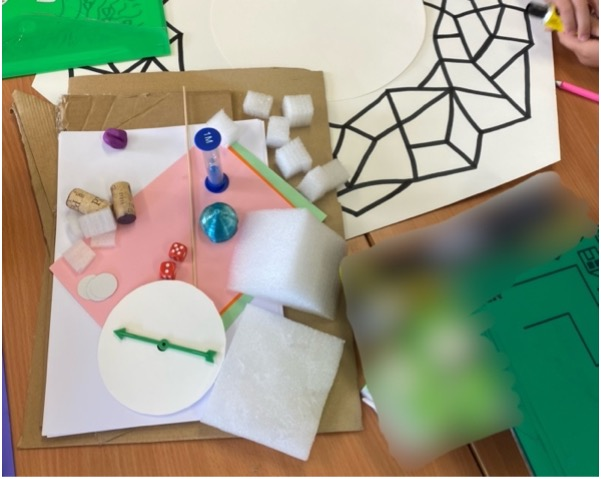

# PartiPlay
Play is a central aspect of childhood development, with games as a vital tool to promote it. However, neurodivergent children, especially those in neurodiverse environments, are underserved by HCI games research. Most existing work takes on a top-down approach, disregarding neurodivergent interest for the majority of the design process. Co-design is often proposed as a tool to create truly accessible and inclusive gaming experiences. Nevertheless, co-designing with neurodivergent children within neurodiverse groups brings about unique challenges, such as diferent communication styles, sensory needs and preferences. Building upon recommendations from prior work in neurodivergent, mixed-ability, and child-led co-design, we propose a concrete participatory game design kit for neurodiverse classrooms: PartiPlay

## Structure
This toolkit includes instructions for running 5 co-design sessions and worksheets that may be utilised to do so. With this toolkit researchers, teachers, educators, or other interested parties can run their own co-design sessions, changing and adapting materials when needed, and co-design their own games with neurodiverse groups of children.

## Instructions
We present these instructions in the past tense, re-telling our use of the toolkit, but not inforcing our methodology on future users. We utilized [Ozobot Evo robots](https://ozobot.com) as the technological element within our co-design process. We encourage you to adapt and change this toolkit to suit your setting and the technology you might have available.
We provided various worksheets and printable materials throughout the co-design sessions, these are available within the folder named “Worksheets”, they are referenced in this guide with their file names as “[WX]”, where X is a number. Whenever children were asked to fill out a worksheet, they were allowed to do this with written words or drawings, the space provided was designed to accommodate both. This measure was put in place to make the activities accessible to the many neurodivergent children who struggled with reading and writing, but it was utilized by many more students who preferred to express their thoughts with pictures rather than words. During presentations children who did not wish to present were allowed to stay back at their tables.

### Session 1 – Building Rapport
**Introduction** – Introducing the team, the goal of the project “building a game together that you can ALL play together” and the Ozobots.
**Icebreaker** – To build rapport and start learning the children’s names, we started with an icebreaker, using a foam ball to make the social mechanics of it explicit. The ball was passed around the class between the students, teacher, and the researchers. Whomever held the ball told the group their name, age, how they were feeling, and a fun fact about them. The ball was then passed to the next person.
**Introduction** - Then we introduced this session’s activities.
**Groups** – In each class, four groups were put together by the respective teacher, to build a sense of partnership and belonging we asked each team member to fill out a worksheet [W1](Worksheets/W1.pdf). In said worksheet, students filled out each of their names and decided on a team name, which was also filled in.
  **Activity 1: Folder Decoration** – To create a sense of continuation throughout the sessions and give the students a record of them that they can own after the project is finished, we decided that each child should have their own project portfolio. To house each portfolio, each child was given an A4 folder. And to build excitement and ownership around it, each child got to decorate their folder, creating drawings in paper that were laminated to the folder by the research team.
  **Activity 2: Robot Decoration** - To familiarize the children with the Ozobots, we engaged them in a crafting activity in which they were given a kit (Figure 1) with which to customize their robot. Each kit contained gem stickers, googly eyes, pompons, sticky tac, pipe cleaners, plasticine, blank and multicolored paper. The children were also allowed to use their colored pencils and pens, glue sticks and scissors. Each group was given a single Ozobot do collaboratively decorate. To preserve the children’s work, their robots were photographed digitally and with a polaroid camera, the latter’s pictures were given to the children along with a worksheet [W2](Worksheets/W2.pdf). In this worksheet children had space to glue their robot’s picture and name it.

Figure 1 - Robot Decorating Kit

**Presentations** – To wrap up the session, each group presented to the class their robot. They were asked to share the robot’s name and whatever characteristics they deemed important.
### Session 2 – Exploring the Ozobots
**Introduction –** To start off the session, children were asked to recall the events of the previous session. Seeing as many had autonomously discovered how to turn on the Ozobot, we asked them to explain to their classmates how to do it. Then we introduced this session’s activities.
  **Activity 1: Storytelling** – To familiarize the children with the Ozobot markers as a programming tool, children were asked to tell a story about the Ozobot’s day. For this they were given an A2 cartoonish map [W3](Worksheets/W3.pdf) of a town on which they were asked to create lines with the markers that allowed the Ozobot to go about its day as they told the story (Figure 2). An A4 version of the map and black paper were also provided as scratch paper.

Figure 2 - Storytelling Materials

 **Activity 2: Puzzle** – To introduce the [Ozobot puzzle](https://www.robot-advance.com/EN/art-ozobot-puzzle-2210.htm) (Figure 3) as another programming tool, children were tasked with guiding the Ozobot home. For this a start piece was placed on one side of the table and another, inside a house structure, on the other side. Children used the remaining puzzle pieces to unite the two, creating a path for the Ozobot to go home.

Figure 3 - Puzzle Materials

 **Activity 3: Dance** – To explore the potential of the remote-control feature of the Ozobot mobile app, children were asked to make the Ozobot dance. Each group got to pick their own song and decorate paper scenarios [W4](Worksheets/W4.pdf) to create their ideal dancefloor. The researchers then played the chosen song, and the children used the mobile app to make the Ozobot move to said song and change LED colors accordingly.
### Session 3 – Game Concepts
**Introduction** – To start off the session, children were asked to recall the events of the previous sessions. Then they were asked to recall what the goal of the project was. Finally, they were introduced to this session’s activity.
**Energizer** – To get the children thinking about games, we started with an energizer. Like the first session’s icebreaker, a ball was passed around the class. Whomever held the ball told the group what their favorite game was and why.
**Introduction** – Using the games mentioned by the children as examples, the researchers prompted the children to identify specific characteristics in these games, explain the meaning of each characteristic along the way. These characteristics were the same as the activity’s worksheet [W5](Worksheets/W5.pdf).
 **Activity: Design by Extended Proxy** – To promote the design of an inclusive game without putting the neurodivergent children in the spotlight, each group was given a stuffed animal (Figure 4) “friend” with specific characteristics. These characteristics, communicated in a worksheet [W6](Worksheets/W6.pdf) with an image representing said animal, mirrored the characteristics of neurodivergent group members. In case of fully neurotypical groups, the characteristics were tailored to represent the behavior of any group member’s that had been used to justify exclusion in previous sessions. Each group was asked to create a game, using the Ozobot, for their “friend”. Two curricular themes were set for the games, sustainability, and the oceans, to promote convergent design across classes. To express their game concepts children were asked to fill in a worksheet detailing the game’s setting, the Ozobot’s in-game function, the game’s goal, obstacles, and aids. Each group was also provided blank paper to create more materials that helped them communicate their concept if they desired to do so. Ozobots were made available for groups to have at their tables and better conceptualize their in-game function.

Figure 4 - Stuffed Animal Proxies

**Presentations** – To wrap up the session, each group presented to the class their “friend” and the game concept they had created for said “friend”.
### Session 4 – Conceptualizing Minigames
**Introduction** – To start off the session, children were asked to recall the events of the previous sessions. Then we caught them up on our in-between sessions work and presented the main game concept. They were introduced to this session’s activity and given a run-through of its worksheet [W7]. Finally, to introduce the concept of minigames, we had a collective brainstorming of games that can be played while sitting at the table, with no screens, and in little time.
 **Activity: Minigame Conceptualization** – Each group was given one of the four themes distilled from the original concepts, escaping from a shark, sorting trash in recycling bins, finding an underwater treasure, and rescuing animals, and asked to create a minigame relating to it. Like in the previous session, children were asked to fill in a worksheet detailing the game’s setting, whether or not the Ozobot was part of their game, and if so, how would it be controlled and what would be its function, the game’s goal, obstacles, aids, starting point, actions, how one wins or loses and the respective reward or consequence. Besides the worksheet, each group was given a gameboard protype and blank scratch paper, to help with the conceptualization. Ozobots were made available upon request. Children were asked to not color or write on the gameboard and informed that they would be able to do so the following week. To help plan the next session, children were asked to fill out a list of necessary game pieces to play their game.
**Presentations** – To wrap up the session, each group presented to their minigame concept.
### Session 5 – Prototyping and Playing
**Introduction** – To start off the session, children were asked to recall the events of the previous sessions. They were introduced to this session’s activity and some general ground rules for it.
 **Activity: Low-Fidelity Prototyping** – Each group was given a game prototyping kit (Figure 5) consisting off: a gameboard prototype, a 3D printed Ozobot hat, a few pieces of recycled cardboard, blank and colored paper, a few blocks of foam in varying sizes, blank construction paper coins, two six-sided die, a spinner with a blank base, a few wine corks, a few wooden skewers, and a sand watch. Extras of these materials were available upon request. Groups who had specified materials outside these in their lists in the previous session, received said materials as well, such as the Ozobot puzzle and blank playing cards. Children were encouraged to use their own glue, makers, pencils, and scissors, as well as other materials available in the classroom, if allowed by the teacher. Two ground rules were established: paint was not to be used as the drying time made it impossible to complete the activity and the Ozobot’s decoration should be done on the provided hat and not the robot itself as to preserve their creations. The groups were tasked with creating all the necessary elements to play their minigame.

Figure 5 - Low-Fidelity Prototyping Materials

**Playtesting** – After the prototypes were ready, each group elected one or more members to stay at their table and explain the game to classmates, while the remainder of the group went to playtest another group’s minigame. Children went from table to table trying out different games.
